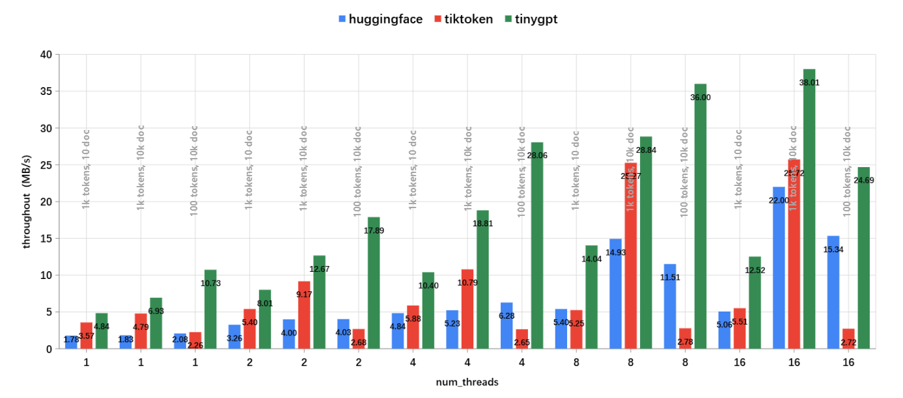

# TinyGPT
Tiny C++ LLM inference implementation from scratch.

- [x] GPT-2
- [x] Llama3.2
- [x] Qwen2.5
- [x] Qwen3
- [x] Mistral

## Features

- [x] Fast BPE tokenizer, inspired by [tiktoken](https://github.com/openai/tiktoken).
- [x] CPU/CUDA inference.
- [x] FP32/FP16/BF16 inference.
- [x] KV Cache

`tinygpt::tokenizer` is faster than both [HuggingFace Tokenizers](https://github.com/huggingface/tokenizers) and [OpenAI tiktoken](https://github.com/openai/tiktoken)，the encoding speed was measured using the [~/benches/tokenizer.py](https://github.com/keith2018/TinyGPT/blob/main/benches/tokenizer.py) script on a machine with an Intel(R) Xeon(R) Platinum 8255C CPU @ 2.50GHz.



## TODO

- [ ] Paged Attention
- [ ] Continuous Batching
- [ ] CUDA Graph
- [ ] Kernel Fusion

## Build and Run

### 1. Get the code

```bash
git clone --recurse-submodules https://github.com/keith2018/TinyGPT.git
```

### 2. Download model files from huggingface
    
```bash
git clone https://huggingface.co/openai-community/gpt2
git clone https://huggingface.co/meta-llama/Llama-3.2-1B
git clone https://huggingface.co/meta-llama/Llama-3.2-3B
git clone https://huggingface.co/Qwen/Qwen2.5-0.5B
git clone https://huggingface.co/Qwen/Qwen2.5-3B
git clone https://huggingface.co/Qwen/Qwen3-1.7B
git clone https://huggingface.co/mistralai/Mistral-7B-v0.3
```
if success, set the path in file [`./demo/demo_gpt.cpp`](https://github.com/keith2018/TinyGPT/blob/main/demo/demo_gpt.cpp)

```cpp
const std::string MODEL_DIR = "path to model files (huggingface repo)";
```

### 3. Build and Run

```bash
mkdir build
cmake -B ./build -DCMAKE_BUILD_TYPE=Release
cmake --build ./build --config Release
```

This will generate the executable file and copy assets to directory `demo/bin`, then you can run the demo:

```bash
cd demo/bin
./TinyGPT_demo
```

demo output:

```
[INFO] Load model ...
[INFO] Load model done.
[INFO] Generated Outputs:
[INFO] ------------------------------------------------------------
[INFO] Prompt:    'Hello, my name is'
[INFO] Output:    ' Max! I am Phelan and I'm the world's greatest magician! I am the world's greatest magician! You are the world's greatest magician! You'
[INFO] ------------------------------------------------------------
[INFO] Prompt:    'The president of the United States is'
[INFO] Output:    ' on a temporary trip to Asia, and the Pentagon has made several announcements about what's next for the war on terror.\n\nThe next day, General Martin Dempsey'
[INFO] ------------------------------------------------------------
[INFO] Prompt:    'The capital of France is'
[INFO] Output:    ' located in the eastern part of the country, so it is very easy to find houses in this part of the country. The most important houses are in Paris, and'
[INFO] ------------------------------------------------------------
[INFO] Prompt:    'The future of AI is'
[INFO] Output:    ' forever. Our time is now.\n\n\nSequel to the game, The Mighty Ducks is available on Android and iOS, and a new Android app is also coming'
[INFO] ------------------------------------------------------------
[INFO] Time cost: 1907 ms, speed: 83.90 token/s
```

## Python binding

```python
# pip install .

import tinygpt
enc = tinygpt.Tokenizer()
enc.init_with_config("tokenizer.json", "tokenizer_config.json")
ids = enc.encode("This is a test")
```

## Dependencies

- Tensor
  - `TinyTorch` [https://github.com/keith2018/TinyTorch](https://github.com/keith2018/TinyTorch)
- JsonParser
  - `RapidJSON` [https://github.com/Tencent/rapidjson](https://github.com/Tencent/rapidjson)
- Regex
  - `pcre2` [https://github.com/PCRE2Project/pcre2](https://github.com/PCRE2Project/pcre2)
- Unicode
  - `utf8proc` [https://github.com/JuliaStrings/utf8proc](https://github.com/JuliaStrings/utf8proc)
- HashMap
  - `ankerl::unordered_dense` [https://github.com/martinus/unordered_dense](https://github.com/martinus/unordered_dense)
- ConcurrentQueue
  - `moodycamel::ConcurrentQueue` [https://github.com/cameron314/concurrentqueue](https://github.com/cameron314/concurrentqueue)

## License

This code is licensed under the MIT License (see [LICENSE](LICENSE)).
