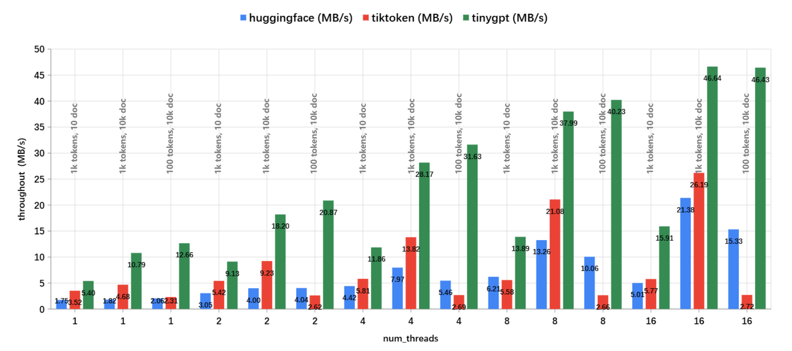
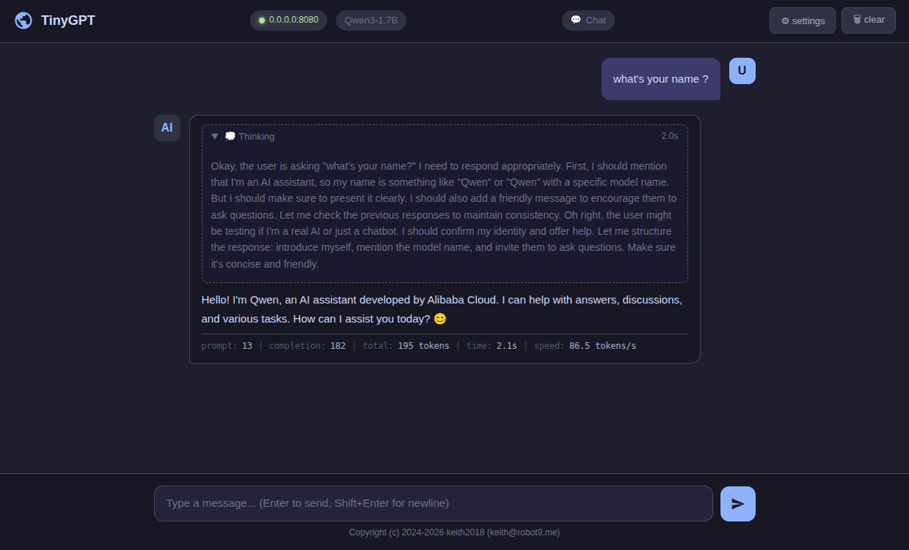

# TinyGPT

Tiny C++ LLM inference implementation from scratch.

## Supported Models

- GPT-2
- Llama 3.2
- Qwen 2.5
- Qwen 3
- Mistral

## Features

- Fast BPE tokenizer, inspired by [tiktoken](https://github.com/openai/tiktoken)
- CPU / CUDA inference
- FP32 / FP16 / BF16 inference
- KV Cache
- Flash Attention via [TinyFA](https://github.com/keith2018/TinyFA)

### Tokenizer Benchmark

`tinygpt::tokenizer` is faster than both [HuggingFace Tokenizers](https://github.com/huggingface/tokenizers)
and [OpenAI tiktoken](https://github.com/openai/tiktoken). The encoding speed was measured using
the [benches/tokenizer.py](https://github.com/keith2018/TinyGPT/blob/main/benches/tokenizer.py) script on a machine with
an Intel(R) Xeon(R) Platinum 8255C CPU @ 2.50GHz.



## TODO

- [ ] Distributed Inference
- [ ] Paged Attention
- [ ] Continuous Batching

## Getting Started

### 1. Clone the Repository

```bash
git clone --recurse-submodules https://github.com/keith2018/TinyGPT.git
cd TinyGPT
```

### 2. Download Model Files

Download model files from HuggingFace:

```bash
git clone https://huggingface.co/openai-community/gpt2
git clone https://huggingface.co/meta-llama/Llama-3.2-1B
git clone https://huggingface.co/meta-llama/Llama-3.2-3B
git clone https://huggingface.co/Qwen/Qwen2.5-0.5B
git clone https://huggingface.co/Qwen/Qwen2.5-3B
git clone https://huggingface.co/Qwen/Qwen3-1.7B
git clone https://huggingface.co/mistralai/Mistral-7B-v0.3
```

### 3. Build

```bash
mkdir build
cmake -B ./build -DCMAKE_BUILD_TYPE=Release
cmake --build ./build --config Release
```

## Examples

The `examples/` directory contains independent sub-projects that can be built and run separately.

### Tokenizer

Benchmark the BPE tokenizer encoding speed:

```bash
cd examples/tokenizer/bin
./TinyGPT_example_tokenizer
```

### Inference

Run model inference with configurable parameters:

```bash
cd examples/inference/bin
./TinyGPT_example_inference --model /path/to/model
```

Available options:

| Option                       | Default    | Description                         |
|------------------------------|------------|-------------------------------------|
| `--model <path>`             | (required) | Path to HuggingFace model directory |
| `--device <cpu\|cuda>`       | `cuda`     | Device type                         |
| `--dtype <fp32\|fp16\|bf16>` | `bf16`     | Data type                           |
| `--max-tokens <n>`           | `32`       | Max new tokens to generate          |
| `--temperature <f>`          | `0.8`      | Sampling temperature                |
| `--top-p <f>`                | `0.9`      | Top-p (nucleus) sampling            |

Example output:

```
[INFO] Load model ...
[INFO] Load model done.
[INFO] Generated Outputs:
[INFO] ------------------------------------------------------------
[INFO] Prompt:    'Hello, my name is'
[INFO] Output:    ' Max! I am Phelan and I'm the world's greatest magician! ...'
[INFO] ------------------------------------------------------------
[INFO] Prompt:    'The president of the United States is'
[INFO] Output:    ' on a temporary trip to Asia, and the Pentagon has made several announcements ...'
[INFO] ------------------------------------------------------------
[INFO] Time cost: 1907 ms, speed: 83.90 token/s
```

## Server

TinyGPT includes an OpenAI-compatible API server with a built-in Web UI.

### Start the Server

```bash
cd server/bin
./TinyGPT_server --model /path/to/model
```

Available options:

| Option                | Default    | Description                                       |
|-----------------------|------------|---------------------------------------------------|
| `--model <path>`      | (required) | Path to HuggingFace model directory               |
| `--host <addr>`       | `0.0.0.0`  | Server host address                               |
| `--port <port>`       | `8080`     | Server port                                       |
| `--max-tokens <n>`    | `4096`     | Max new tokens per request                        |
| `--temperature <f>`   | `0.7`      | Sampling temperature                              |
| `--top-p <f>`         | `0.9`      | Top-p sampling                                    |
| `--min-p <f>`         | `0.0`      | Min-p sampling                                    |
| `--chat-template <s>` | auto       | Custom chat template (Jinja2 string or file path) |
| `--web-dir <path>`    | auto       | Path to web UI directory                          |

### API Endpoints

The server implements the following OpenAI-compatible endpoints:

- `GET  /v1/models` — List available models
- `POST /v1/completions` — Text completions
- `POST /v1/chat/completions` — Chat completions (supports streaming via SSE)

### Web UI

Once the server is running, open `http://localhost:8080` in your browser to access the built-in Web UI.



## Python Binding

```python
# pip install .

import tinygpt

enc = tinygpt.Tokenizer()
enc.init_with_config("tokenizer.json", "tokenizer_config.json")
ids = enc.encode("This is a test")
```

## Dependencies

| Library                                                                      | Purpose           |
|------------------------------------------------------------------------------|-------------------|
| [TinyTorch](https://github.com/keith2018/TinyTorch)                          | Tensor operations |
| [TinyFA](https://github.com/keith2018/TinyFA)                                | Flash Attention   |
| [RapidJSON](https://github.com/Tencent/rapidjson)                            | JSON parsing      |
| [pcre2](https://github.com/PCRE2Project/pcre2)                               | Regex             |
| [utf8proc](https://github.com/JuliaStrings/utf8proc)                         | Unicode           |
| [ankerl::unordered_dense](https://github.com/martinus/unordered_dense)       | HashMap           |
| [moodycamel::ConcurrentQueue](https://github.com/cameron314/concurrentqueue) | Concurrent queue  |

## License

This code is licensed under the MIT License (see [LICENSE](LICENSE)).
