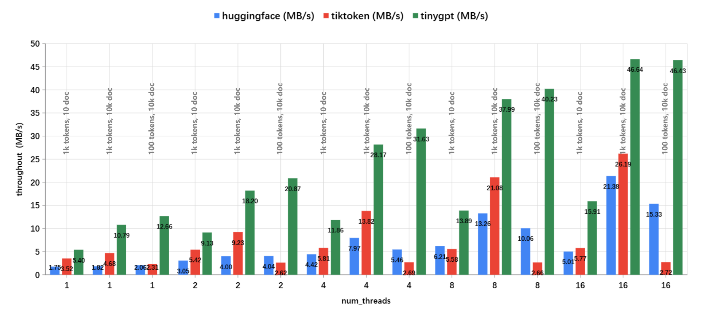

# TinyGPT
TinyGPT is a minimal C++11 implementation of GPT-2 inference, built from scratch and mainly inspired by the [picoGPT](https://github.com/jaymody/picoGPT) project.

For more details, check out the accompanying blog post: [Write a GPT from scratch (TinyGPT)](https://robot9.me/write-gpt-from-scratch/)

## Features

- Fast BPE tokenizer, inspired by [tiktoken](https://github.com/openai/tiktoken).
- CPU and CUDA inference.
- KV cache enabled.

`tinygpt::tokenizer` is faster than both [HuggingFace Tokenizers](https://github.com/huggingface/tokenizers) and [OpenAI tiktoken](https://github.com/openai/tiktoken)，the encoding speed was measured using the [~/benches/tokenizer.py](https://github.com/keith2018/TinyGPT/blob/main/benches/tokenizer.py) script on a machine with an Intel(R) Xeon(R) Platinum 8255C CPU @ 2.50GHz.



## Build and Run

### 1. Get the code

```bash
git clone --recurse-submodules https://github.com/keith2018/TinyGPT.git
```

### 2. Download GPT-2 model file
    
```python
python3 tools/download_gpt2_model.py
```
if success, you'll see the file `model_file.data` in directory `assets/gpt2`

### 3. Build and Run

```bash
mkdir build
cmake -B ./build -DCMAKE_BUILD_TYPE=Release
cmake --build ./build --config Release
```

This will generate the executable file and copy assets to directory `app/bin`, then you can run the demo:

```bash
cd app/bin
./TinyGPT_demo
[DEBUG] TIMER TinyGPT::Model::loadModelGPT2: cost: 800 ms
[DEBUG] TIMER TinyGPT::Encoder::getEncoder: cost: 191 ms
INPUT:Alan Turing theorized that computers would one day become
GPT:the most powerful machines on the planet.
INPUT:exit
```

## Dependencies

- Tensor
  - `TinyTorch` [https://github.com/keith2018/TinyTorch](https://github.com/keith2018/TinyTorch)
- Json parser
  - `RapidJSON` [https://github.com/Tencent/rapidjson](https://github.com/Tencent/rapidjson)
- Regex (Tokenizer)
  - `pcre2` [https://github.com/PCRE2Project/pcre2](https://github.com/PCRE2Project/pcre2)
- HashMap
  - `ankerl::unordered_dense` [https://github.com/martinus/unordered_dense](https://github.com/martinus/unordered_dense)

## License

This code is licensed under the MIT License (see [LICENSE](LICENSE)).
